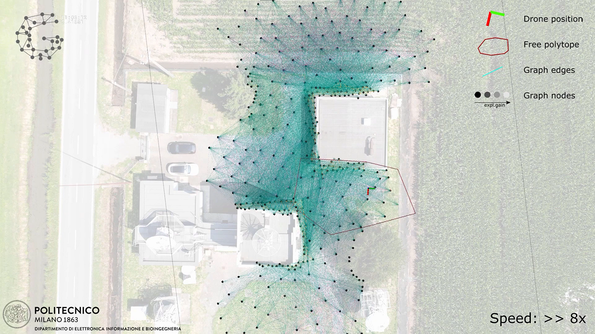
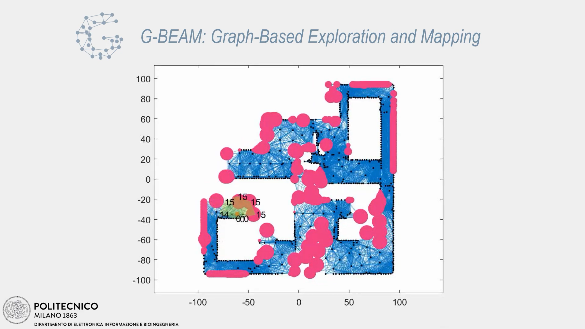
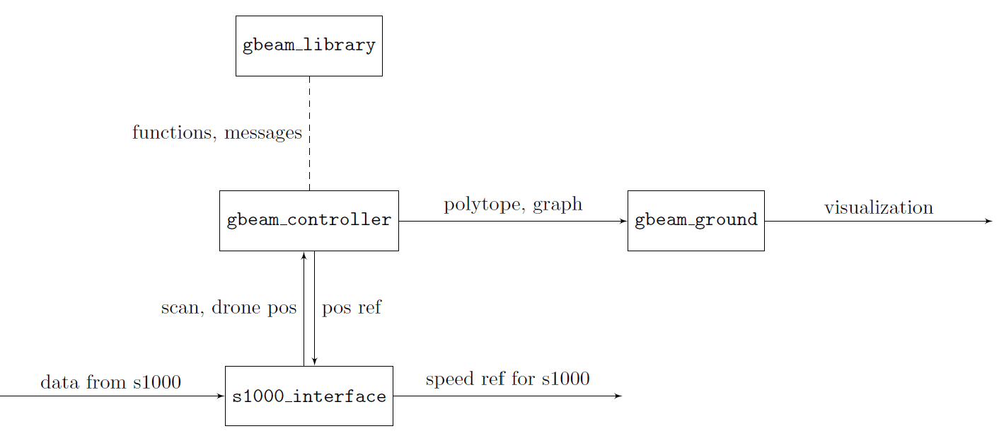

# G-BEAM (Graph-Based Exploration And Mapping) ROS packages

This repository contains the ROS packages developed and used for simulation and experimental tests of G-Beam controller.
The control algorithm is described in the article **insert article here**.

## Test videos

### G-BEAM experimental Tests, ROS + Quadcopter Drone
[](https://www.youtube.com/watch?v=0suE8IxzbC0)

### G-BEAM simulation on MatLab/Simulink
[](https://www.youtube.com/watch?v=9D0L84BI0Cg)

## Scheme of the packages

This scheme represents the interactions between the packages:
Package `s1000_interface` is used to interact with the lower level controller of the drone (a DJI S1000, controlled with a DJI A3 board) and the LiDAR sensor.
Package `gbeam_controller` is where the control algorithm is actually implemented.
Package `gbeam_ground` contains the nodes that allow the visualization of the data from the other packages, it reads the topics with custom messages, and writes on topics with standard messages to be shown in `rviz`.
Package `gbeam_library` contains message definitions and functions used by the other packages.

## Installation
Here a short description of the installation procedure is given.

### Requirements
This package is developed and tested on Ubuntu 20.04 Focal Fossa, with ROS noetic.
The ROS installation process is described in the [official wiki](http://wiki.ros.org/noetic/Installation/Ubuntu).

### Setup
1. First of all clone the repo in a dedicated workspace (e.g. `~/gbeam_ros_ws`):
    ```
        git clone https://github.com/leonardocecchin/gbeam_ros.git .
    ```
2. (Optional) This package by default uses Turtlebot 3 as a simulation setup, you can clone it in the `src` folder and compile it together with this package to be able to run the default tests. From the `src` folder (e.g. `~/gbeam_ros_ws/src`):
    ```
        git clone https://github.com/ROBOTIS-GIT/turtlebot3_msgs.git
        git clone https://github.com/ROBOTIS-GIT/turtlebot3.git
        git clone https://github.com/ROBOTIS-GIT/turtlebot3_simulations.git
    ```
3. Source your ROS environment script, e.g.:
    ```
        source /opt/ros/noetic/setup.bash
    ```
4. Build the packages with `catkin_make` from the workspace base folder (e.g. `~/gbeam_ros_ws`):
    ```
        catkin_make
    ```


### Testing
It is possible to test the controller by executing it in simulation with Turtlebot 3:
1. Source the environment rom the workspace base folder (e.g. `~/gbeam_ros_ws`):
    ```
        source devel/setup.bash
    ```
2. Select the turtlebot model (`burger`, `waffle` or `waffle_pi`):
    ```
        export TURTLEBOT3_MODEL=burger
    ```
3. Run the simulation:
    ```
        roslaunch gbeam_simulator gbeam_turtlebot3_gazebo.launch
    ```
4. Enable the mapping. In a new terminal, from the workspace base folder (e.g. `~/gbeam_ros_ws`):
    ```
        source devel/setup.bash
        roslaunch gbeam_simulator gbeam_turtlebot3_gazebo.launch
    ```
